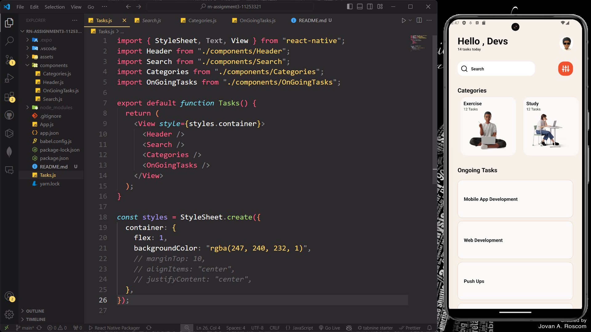

# rn-assignment3-11011390-main
#

# SCREENSHOT OF APPLICATION

# COMPONENTS USAGE

<h3>View</h3>

-A container that supports layout with flexbox, style, touch handling, and accessibility controls.

<h3>Text</h3>

- Used to display text.

<h3>ScrollView</h3>

- A container that allows scrolling of content within it, supporting both vertical and horizontal scrolling.

<h3>TextInput</h3>

- A component for user input, providing a way to input text.

<h3>Stylesheet</h3>

- An abstraction similar to CSS StyleSheets, used to define styles for components.

<h3>Button</h3>

- A simple button component for handling user taps, with a title and an onPress event.

<h3>FlatList</h3>

- An efficient component for rendering large lists of data. It supports scrolling and can render items lazily.

<h3>SectionList</h3>

- Similar to FlatList but allows rendering sections with headers, suitable for grouped data.

<h3>Image</h3>

- Used to display images, supporting various image formats and network images.

